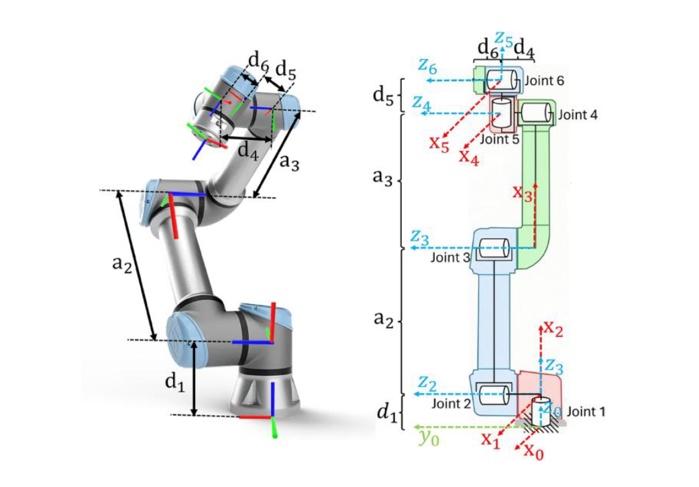
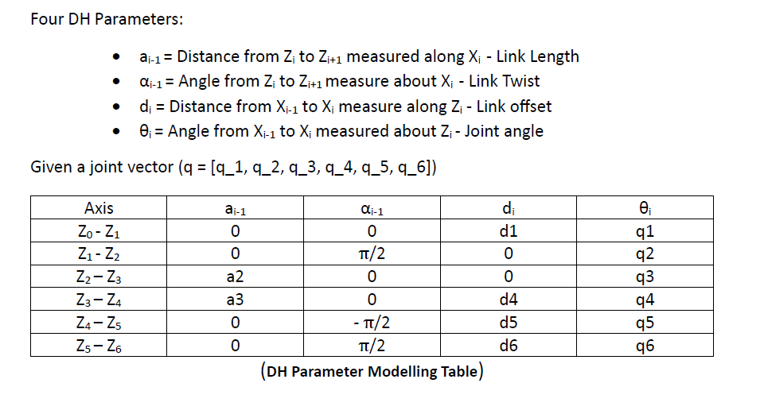
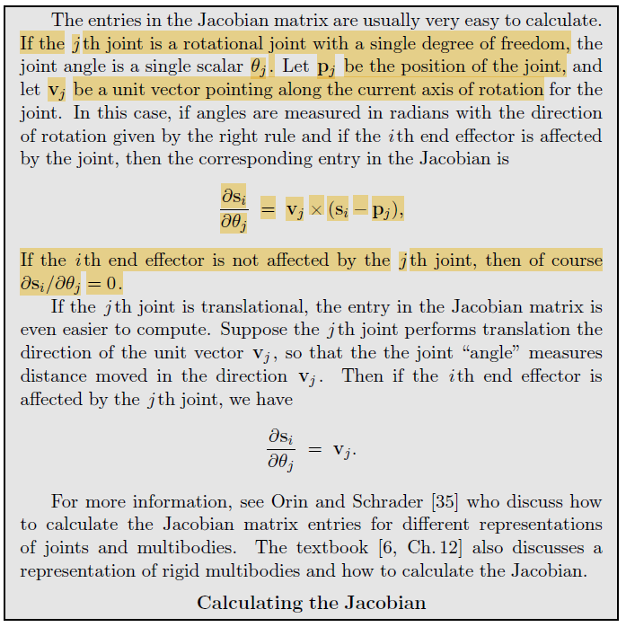

# UR5 Inverse Kinematics Verification Tool

> A mathematically rigorous, from-scratch Python engine to model, compute, and cross-verify the forward and inverse kinematics of a 6-axis Universal Robots UR5 manipulator.

**No black-box libraries. Every transformation, Jacobian, and optimization loop built from first principles.**

<p align="center">
  <br>
  <em>Figure 1: UR5 Industrial Robotic Arm</em>
</p>

---

## 📌 Overview

The UR5 is a 6-DoF (Degree of Freedom) serial manipulator widely used in industrial automation. This project implements a complete kinematics pipeline that:

- Models all joint frames using **Denavit-Hartenberg (DH) parameters**
- Computes exact end-effector poses via **Forward Kinematics (FK)**
- Solves for joint angles from a target pose via **Inverse Kinematics (IK)**
- Verifies IK accuracy by feeding results back through FK and measuring the pose error

The pipeline achieves convergence to a tolerance of **10⁻⁵**, confirming numerical precision across all stages.


This runs the full pipeline: defines a ground-truth joint configuration → computes FK → solves IK → re-verifies via FK → reports the absolute error matrix.

---

## 🔧 Tasks & Algorithm Details

### Task 1 — DH Parameter Modeling

The UR5's kinematic structure is encoded using the **Denavit-Hartenberg convention**, which defines four parameters per joint link:

| Parameter | Symbol | Description |
|-----------|--------|-------------|
| Link twist | α | Angle between Zᵢ and Zᵢ₊₁ about Xᵢ |
| Link length | a | Distance between Zᵢ and Zᵢ₊₁ along Xᵢ |
| Link offset | d | Distance between Xᵢ₋₁ and Xᵢ along Zᵢ |
| Joint angle | θ | Angle between Xᵢ₋₁ and Xᵢ about Zᵢ |

Each pair of consecutive frames is related by a 4×4 homogeneous transformation matrix:

$$
{}^{i-1}T_i =
\begin{bmatrix}
\cos\theta_i & -\sin\theta_i\cos\alpha_i & \sin\theta_i\sin\alpha_i & a_i\cos\theta_i \\
\sin\theta_i & \cos\theta_i\cos\alpha_i & -\cos\theta_i\sin\alpha_i & a_i\sin\theta_i \\
0 & \sin\alpha_i & \cos\alpha_i & d_i \\
0 & 0 & 0 & 1
\end{bmatrix}
$$


<p align="center">
  <br>
  <em>Figure 2: DH Parameter Model for UR5</em>
</p>

---

### Task 2 — Forward Kinematics (FK)

Forward Kinematics computes the **end-effector pose** (position + orientation) from a given set of joint angles by chaining all six transformation matrices:

$$T_{0 \to 6} = \^0T_1 \cdot \^1T_2 \cdot \^2T_3 \cdot \^3T_4 \cdot \^4T_5 \cdot \^5T_6$$

The result is a 4×4 homogeneous matrix encoding the full 3D pose of the tool frame relative to the robot base:

$$
T =
\begin{bmatrix}
R_{3\times3} & p_{3\times1} \\
0_{1\times3} & 1
\end{bmatrix}
$$

where **R** is the rotation matrix and **p** is the end-effector position vector.

---

### Task 3 — Inverse Kinematics (IK)

Given a desired end-effector pose **T_desired**, IK solves for the joint angle vector **q** that achieves it. This is a nonlinear problem with no closed-form solution in general, so a numerical approach is used.

**Method: Newton-Raphson with Moore-Penrose Pseudo-Inverse**

The iterative update rule is:

$$q_{k+1} = q_k + J^+(q_k) \cdot \Delta x$$

where:
- **Δx** is the pose error (position + orientation) between the current and desired end-effector frame
- **J(q)** is the 6×6 **geometric Jacobian**, relating joint velocities to end-effector velocities
- **J⁺** is the **Moore-Penrose pseudo-inverse** of the Jacobian, providing a robust least-squares solution even near singular configurations

<p align="center">
  <br>
  <em>Figure 3: Jacobian Matrix Formulation used with Newton-Raphson</em>
</p>

The loop iterates until the pose error norm falls below the convergence threshold of **10⁻⁵**.

---

### Task 4 — Verification Pipeline

A round-trip test validates the full pipeline end-to-end:

```
Step 1: Ground Truth
        Define a known joint vector q_true = [θ₁, θ₂, θ₃, θ₄, θ₅, θ₆]

Step 2: Target Pose Generation
        T_desired = FK(q_true)

Step 3: IK Execution
        q_calculated = IK(T_desired)   ← solver sees only the pose, not q_true

Step 4: Re-verification
        T_verified = FK(q_calculated)

Step 5: Error Evaluation
        Error = ‖T_desired − T_verified‖
```

A successful run produces an absolute error below **10⁻⁵**, confirming that the IK solver reliably recovers a joint configuration that reproduces the target pose to numerical precision.

---

## 🔑 Key Functions Reference

| Function | Description |
|----------|-------------|
| `dh_transform(a, alpha, d, theta)` | Computes single-link DH transformation matrix |
| `forward_kinematics(q)` | Chains all 6 DH transforms → end-effector pose T |
| `geometric_jacobian(q)` | Computes the 6×6 Jacobian at joint configuration q |
| `inverse_kinematics(T_desired, q0)` | Newton-Raphson IK solver with pseudo-inverse |
| `pose_error(T_current, T_desired)` | Computes 6D error vector (position + orientation) |
| `verify_pipeline(q_true)` | Full round-trip verification and error report |

---

## 📚 References

- Denavit, J. & Hartenberg, R.S. (1955). *A kinematic notation for lower-pair mechanisms based on matrices.* ASME Journal of Applied Mechanics.
- Spong, M.W., Hutchinson, S., & Vidyasagar, M. *Robot Modeling and Control.* Wiley, 2006.
- [Universal Robots UR5 Technical Specifications](https://www.universal-robots.com/products/ur5-robot/)
- [Wikipedia — Denavit–Hartenberg parameters](https://en.wikipedia.org/wiki/Denavit%E2%80%93Hartenberg_parameters)
- [Wikipedia — Moore–Penrose inverse](https://en.wikipedia.org/wiki/Moore%E2%80%93Penrose_inverse)

---

## 📄 License

This project is for academic and educational purposes.
